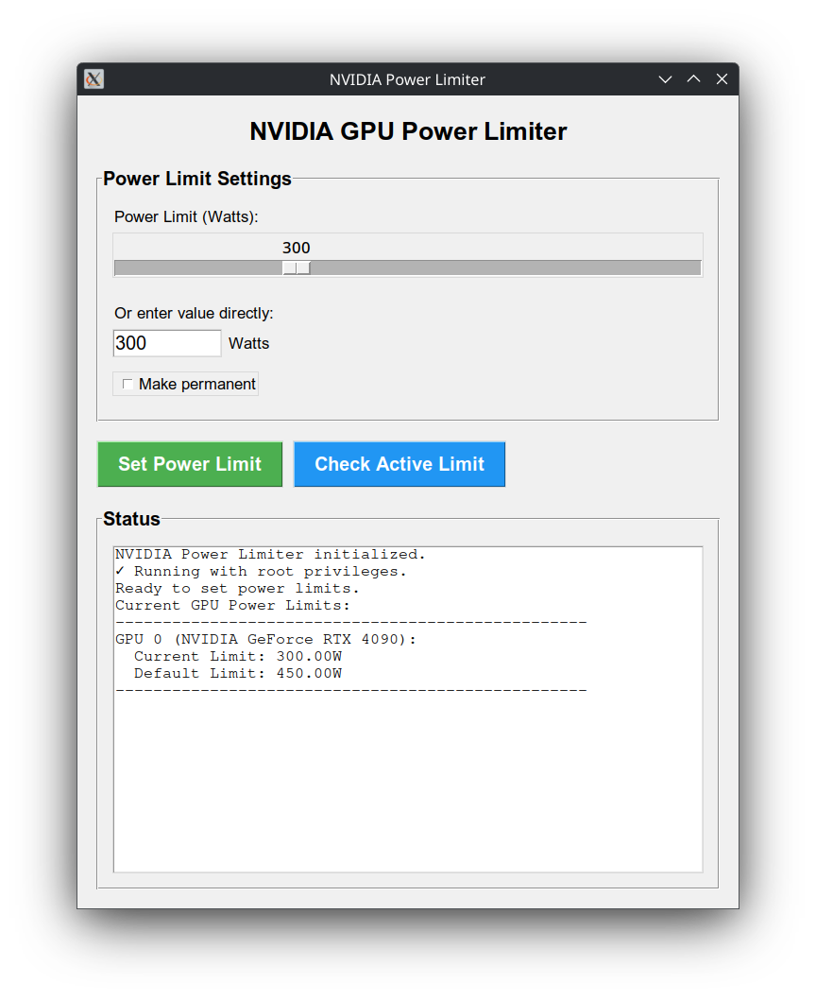

# NVIDIA Power Limiter

A simple GUI application for controlling NVIDIA GPU power limits on Linux using `nvidia-smi`.

## Features

- **Power Limit Control**: Set GPU power limits from 0-1000W via slider or direct input
- **Persistence Mode**: Option to make power limit changes permanent
- **Multi-GPU Support**: Automatically detects and manages all NVIDIA GPUs
- **Real-time Status**: Check current vs default power limits
- **Clean Interface**: Built with tkinter for simplicity

## Requirements

- Linux system
- NVIDIA GPU with drivers installed
- `nvidia-smi` command available
- Python 3 with tkinter
- Root/sudo privileges

## Usage

Run with sudo privileges:
```bash
sudo python3 nvidia_power_limiter.py
```

Or use the provided launcher script:
```bash
./run.sh
```

## Setup

**Important**: The `run.sh` script contains hardcoded paths and must be customized for your system:

1. Edit `run.sh` and update the path to match your installation directory
2. Make the script executable: `chmod +x run.sh`
3. Optionally install the `.desktop` file for GUI launcher integration

## Screenshot

